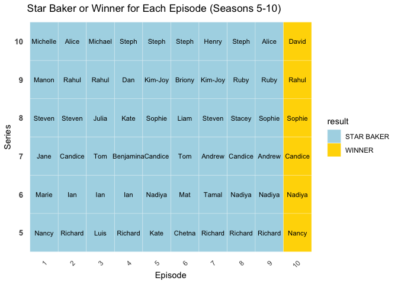
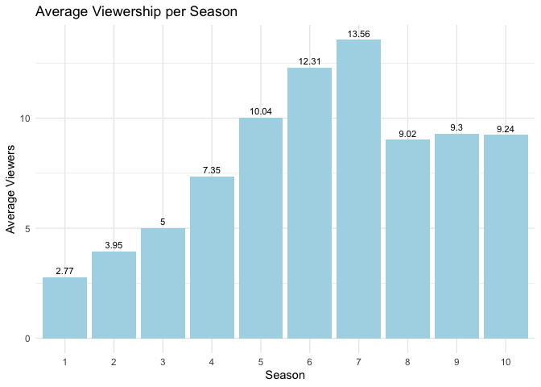

P8105_HW2_bt2654
================
Boxiang Tang (UNI: bt2654)
2024-09-25

# Problem_1

## Part_1

``` r
library(tidyverse)
library(dplyr)

NYC_Transit_Sub_df <- 
  read_csv("data/NYC_Transit_Subway_Entrance_And_Exit_Data.csv") |>
  janitor::clean_names()
```

``` r
# Clean and tidy the data
NYC_Transit_Sub_df_1 <- 
  NYC_Transit_Sub_df |>
  select(line = line, 
         station_name, 
         station_latitude, 
         station_longitude, 
         starts_with("Route"), 
         entry, 
         vending, 
         entrance_type, 
         ADA_Compliance = ada) |>
  mutate(entry = ifelse(entry == "YES", TRUE, FALSE))
```

1.  Notice that after the initial data cleaning, our new data frame
    totally contains 19 variables including: **(line, station_name,
    station_latitude, station_longitude, route1, route2, route3, route4,
    route5, route6, route7, route8, route9, route10, route11, entry,
    vending, entrance_type, ADA_Compliance)**. Among those variables,
    the numeric variables are **(station_latitude, station_longitude,
    route8, route9, route10, route11)**, character variables are
    **(line, station_name, route1, route2, route3, route4, route5,
    route6, route7, vending, entrance_type)**, logical variables are
    **(entry, ADA_Compliance)**, and there is no factor variable.

2.  In addition to that, my previous data cleaning steps including:

- Selection of Relevant Columns: The data was filtered to retain only
  the relevant columns for analysis, including line, station name,
  geographic coordinates, routes served, entry, vending, entrance type,
  and ADA compliance.

- Renaming Columns: For clarity, some columns were renamed to make them
  more interpretable.

- Converting Entry Variable: The Entry variable was converted from
  character values (“YES”/“NO”) to logical values (TRUE/FALSE).

3.  The dimension of the data would be 1868 \* 19 (row \* columns)

4.  Our data is still untidied, there are some remaining issues:

- 1.  There are several columns that contain mostly or entirely NA
      values.This suggests that these columns may make the data set
      difficult to analysis and process.
- 2.  notice that there are multiple route columns represent a similar
      variable, this could be an indicator that the data is not fully
      normalized or tidy. A better structure might use a single column
      for the route name rather than spreading it across several
      columns.

## Part_2

``` r
distinct_stations <-
NYC_Transit_Sub_df_1 |>
  distinct(station_name, line, .keep_all = TRUE)
```

- For our tidied data set, totally there are 465 distinct stations.

``` r
ada_compliant_count <-
  sum(distinct_stations$ADA_Compliance == "TRUE", 
      na.rm = TRUE)
```

- There are 84 stations that are ADA compliant.

``` r
no_vending_prop <-
  NYC_Transit_Sub_df_1 |>
  filter(vending == "NO") |>    
  summarise(proportion = mean(entry == "TRUE"))  
```

- Approximately there are 37.7% of station entrances/exits without
  vending allow entrance.

``` r
NYC_Transit_Sub_df_2 <-
  NYC_Transit_Sub_df_1 |>
  mutate(across(where(is.numeric),
                as.character)) |>
  pivot_longer(cols = starts_with("route"), 
               names_to = "route_number", 
               values_to = "route_name") |>
  filter(route_name == "A")
 


distinct_stations_a <-
  NYC_Transit_Sub_df_2 |>
  distinct(station_name, 
           station_latitude, 
           station_longitude) |>
  nrow()


ada_compliant_stations <-
  NYC_Transit_Sub_df_2 |>
  filter(ADA_Compliance == TRUE) |>
  distinct(station_name, 
           station_latitude, 
           station_longitude) |>
  nrow()
```

- Notice that there are 60 distinct stations serve the A train.
- Of the stations that serve A train, there are 17 of them are ADA
  compliant.

# Problem_2

``` r
library(readxl)


mr_trash_wheel <-
  read_excel("data/202409 Trash Wheel Collection Data.xlsx", 
             sheet = "Mr. Trash Wheel", 
             skip = 1) |>
  janitor::clean_names() |>
  select(dumpster:homes_powered) |>
  filter(!is.na(dumpster)) |>
  mutate(sports_balls = as.integer(round(sports_balls, 0)),
         year = as.numeric(year),
         homes_powered = (weight_tons * 500 / 30),
         trash_wheel = "Mr. Trash Wheel")


prof_trash_wheel <-
  read_excel("data/202409 Trash Wheel Collection Data.xlsx", 
             sheet = "Professor Trash Wheel", 
             skip = 1) |>
  janitor::clean_names() |>
  select(dumpster:homes_powered) |>
  filter(!is.na(dumpster)) |>
  mutate(year = as.numeric(year),
         homes_powered = (weight_tons * 500 / 30),
         trash_wheel = "Professor Trash Wheel")


gwynnda_trash_wheel <-
  read_excel("data/202409 Trash Wheel Collection Data.xlsx", 
             sheet = "Gwynnda Trash Wheel", 
             skip = 1) |>
  janitor::clean_names() |>
  select(dumpster:homes_powered) |>
  filter(!is.na(dumpster)) |>
  mutate(year = as.numeric(year),
         homes_powered = (weight_tons * 500 / 30),
         trash_wheel = "Gwynnda Trash Wheel")


combined_data <- bind_rows(mr_trash_wheel, 
                           prof_trash_wheel, 
                           gwynnda_trash_wheel)
```

### Data Descriptions:

**About the data of Mr. Trash Wheel:**

- This dataset contains 15 variables and 651 observations (dumpsters).
  The data was collected over the years 2014, 2015, 2016, 2017, 2018,
  2019, 2020, 2021, 2022, 2023, 2024, with the number of observations in
  each year being: 44, 71, 51, 55, 93, 66, 72, 58, 57, 62, 22.

- The weight of trash collected by Mr. Trash Wheel dumpsters ranges from
  0.78 tons to 5.62 tons, with an average of 3.21 tons per dumpster.
  Cumulatively, Mr. Trash Wheel has collected 2091.18 tons of trash.

- The volume of trash collected ranges from 7 cubic yards to 20 cubic
  yards, with an average of 15.24 cubic yards per dumpster. In total,
  the dumpsters have collected 9919 cubic yards of trash.

- For specific types of trash, the average number of plastic bottles
  collected per dumpster is 1966, and cumulatively, Mr. Trash Wheel has
  collected 1280075 plastic bottles.

- The average number of polystyrene collected is 1425, with a total of
  927411 units collected so far.

- For cigarette butts, each dumpster collects an average of 1.8136^{4},
  with a cumulative total of 11806700 cigarette butts collected.

- The average number of glass bottles per dumpster is 21, and
  cumulatively, Mr. Trash Wheel has collected 13913 glass bottles.

- The average number of plastic bags collected per dumpster is 849, and
  cumulatively, the trash wheel has collected 552734 plastic bags.

- Each dumpster collects an average of 1452 wrappers, with a cumulative
  total of 945129 wrappers collected.

- The average number of sports balls per dumpster is 14, with a total of
  9098 sports balls collected.

- Regarding energy, on average, each dumpster powers the equivalent of
  53.54 homes, with a cumulative total of 3.4853^{4} homes powered by
  the collected trash.

**About the data of Professor Trash Wheel:**

- This dataset contains 14 variables and 119 observations (dumpsters).
  The data was collected over the years 2017, 2018, 2019, 2020, 2021,
  2022, 2023, 2024, NA, with the number of observations in each year
  being: 18, 24, 15, 13, 15, 16, 13, 4.

- The weight of trash collected by Professor Trash Wheel dumpsters
  ranges from 0.61 tons to 3.75 tons, with an average of 2.09 tons per
  dumpster. Cumulatively, Professor Trash Wheel has collected 246.74
  tons of trash.

- The volume of trash collected ranges from 6 cubic yards to 18 cubic
  yards, with an average of 14.54 cubic yards per dumpster. In total,
  the dumpsters have collected 1716 cubic yards of trash.

- For specific types of trash, the average number of plastic bottles
  collected per dumpster is 5070, and cumulatively, Professor Trash
  Wheel has collected 593246 plastic bottles.

- The average number of polystyrene collected is 3816, with a total of
  446455 units collected so far.

- For cigarette butts, each dumpster collects an average of 1.0919^{4},
  with a cumulative total of 1277478 cigarette butts collected.

- The average number of glass bottles per dumpster is 18, and
  cumulatively, Professor Trash Wheel has collected 2151 glass bottles.

- The average number of plastic bags collected per dumpster is 2219, and
  cumulatively, the trash wheel has collected 259674 plastic bags.

- Each dumpster collects an average of 7390 wrappers, with a cumulative
  total of 864682 wrappers collected.

- Regarding energy, on average, each dumpster powers the equivalent of
  34.85 homes, with a cumulative total of 4112.33 homes powered by the
  collected trash.

**About the data of Gwynnda Trash Wheel:**

- This dataset contains 13 variables and 263 observations (dumpsters).
  The data was collected over the years 2021, 2022, 2023, 2024, with the
  number of observations in each year being: 49, 85, 86, 43.

- The weight of trash collected by Gwynnda Trash Wheel dumpsters ranges
  from 0.77 tons to 4.24 tons, with an average of 3.03 tons per
  dumpster. Cumulatively, Gwynnda Trash Wheel has collected 797.55 tons
  of trash.

- The volume of trash collected ranges from 5 cubic yards to 15 cubic
  yards, with an average of 14.92 cubic yards per dumpster. In total,
  the dumpsters have collected 3924 cubic yards of trash.

- For specific types of trash, the average number of plastic bottles
  collected per dumpster is 1507, and cumulatively, Gwynnda Trash Wheel
  has collected 396227 plastic bottles.

- The average number of polystyrene collected is 198, with a total of
  52054 units collected so far.

- For cigarette butts, each dumpster collects an average of 2372, with a
  cumulative total of 623920 cigarette butts collected.

- The average number of plastic bags per dumpster is 545, and
  cumulatively, the trash wheel has collected 143365 plastic bags.

- Each dumpster collects an average of 1666 wrappers, with a cumulative
  total of 243290 wrappers collected.

- Regarding energy, on average, each dumpster powers the equivalent of
  50.54 homes, with a cumulative total of 1.32925^{4} homes powered by
  the collected trash.

``` r
print(combined_data)
```

    ## # A tibble: 1,033 × 15
    ##    dumpster month  year date                weight_tons volume_cubic_yards
    ##       <dbl> <chr> <dbl> <dttm>                    <dbl>              <dbl>
    ##  1        1 May    2014 2014-05-16 00:00:00        4.31                 18
    ##  2        2 May    2014 2014-05-16 00:00:00        2.74                 13
    ##  3        3 May    2014 2014-05-16 00:00:00        3.45                 15
    ##  4        4 May    2014 2014-05-17 00:00:00        3.1                  15
    ##  5        5 May    2014 2014-05-17 00:00:00        4.06                 18
    ##  6        6 May    2014 2014-05-20 00:00:00        2.71                 13
    ##  7        7 May    2014 2014-05-21 00:00:00        1.91                  8
    ##  8        8 May    2014 2014-05-28 00:00:00        3.7                  16
    ##  9        9 June   2014 2014-06-05 00:00:00        2.52                 14
    ## 10       10 June   2014 2014-06-11 00:00:00        3.76                 18
    ## # ℹ 1,023 more rows
    ## # ℹ 9 more variables: plastic_bottles <dbl>, polystyrene <dbl>,
    ## #   cigarette_butts <dbl>, glass_bottles <dbl>, plastic_bags <dbl>,
    ## #   wrappers <dbl>, sports_balls <int>, homes_powered <dbl>, trash_wheel <chr>

**About the combined data frame:**

- The combined data frame combines data from three different trash
  wheels maintained by the Healthy Harbor company, covering the years
  from 2014 to 2023 where data is available. The total number of rows in
  the combined data set is 1033.

- The breakdown of rows per data set is as follows:

  - Mr. Trash Wheel: 651 rows,
  - Professor Trash Wheel: 119 rows,
  - Gwynnda Trash Wheel: 263 rows.

- Totally, the combined data includes 15 variables: dumpster, month,
  year, date, weight_tons, volume_cubic_yards, plastic_bottles,
  polystyrene, cigarette_butts, glass_bottles, plastic_bags, wrappers,
  sports_balls, homes_powered, trash_wheel

### Question Answers:

1.  The total weight collected by Professor Trash Wheel is 246.74.

``` r
total_cigarette_butts <- 
  gwynnda_trash_wheel |>
  filter(month == "June" & year == 2022) |>
  summarise(total_butts = 
            sum(`cigarette_butts`, 
                na.rm = TRUE)) |>
  pull(total_butts)
```

2.  The total number of cigarette butts collected by Gwynnda in June of
    2022 is 18120.

# Problem_3

## Part_1

### Load necessary packages & Import data sets

``` r
library(dplyr)
library(tidyr)
library(janitor)
```

    ## 
    ## Attaching package: 'janitor'

    ## The following objects are masked from 'package:stats':
    ## 
    ##     chisq.test, fisher.test

``` r
bakers <- 
  read.csv("data/gbb_datasets/bakers.csv")|>
  janitor::clean_names()

bakes <- 
  read.csv("data/gbb_datasets/bakes.csv") |>
  janitor::clean_names()

results <- 
  read.csv("data/gbb_datasets/results.csv", skip = 2) |>
  janitor::clean_names()

viewers <- 
  read.csv("data/gbb_datasets/viewers.csv") |>
  janitor::clean_names()
```

### Clean the data sets & Prepare them for merging

``` r
# Step 1: Create a new column in bakers to extract the first word (first name) from baker_name
bakers <- bakers |> 
  mutate(first_name = word(baker_name, 1))  # Extract the first word as first_name

# Step 2: Reshape the viewers dataframe to a long format, extracting series and viewers columns
viewers_long <- 
  viewers |> 
  pivot_longer(cols = starts_with("series_"), 
               names_to = "series", 
               names_prefix = "series_", 
               values_to = "viewers") |> 
  mutate(series = as.integer(series))  # Convert series to integer type
```

- In this section of the code performs two key operations to prepare the
  data for merging. First, it extracts the first word from the
  baker_name column in the bakers dataset to create a new first_name
  column. This step simplifies the merging process with other datasets
  that may use only the first name to identify bakers. Second, the
  viewers dataset is reshaped from a wide format to a long format using
  the `pivot_longer()` function. This restructuring is necessary because
  it allows the data to be aligned by series and episode, enabling more
  efficient merging. Additionally, the series column is converted to an
  integer to ensure compatibility across all datasets during the merging
  process.

### Merge the data frames & Check the validility of the results

``` r
# Step 1: Standardize the names before merging

results <- results |> 
  mutate(baker = ifelse(baker == "Joanne", "Jo", baker))  # Standardize 'Joanne' to 'Jo' in the results dataframe

bakes <- bakes |> 
  mutate(baker = ifelse(baker == "\"Jo\"", "Jo", baker))  # Optional, if you want to make sure no other discrepancies

bakers <- bakers |> 
  mutate(first_name = ifelse(first_name == "Jo", "Jo", first_name))  # Standardize in case of discrepancies in 'bakers'


# Step 2: Merge the data frames

merged_data <- 
  results |>
  left_join(bakes, by = c("series", "episode", "baker")) |>  # Merge based on series, episode, and baker
  left_join(bakers, by = c("baker" = "first_name", "series")) |>  # Merge bakers based on baker and series
  left_join(viewers_long, by = c("series", "episode"))  # Merge viewers_long based on series and episode


# Step 3: Check for mismatched rows across datasets using anti_join


# Find rows in merged_data that don't match viewers_long (by series and episode)
unmatched_in_merged_1 <- 
  merged_data |> 
  anti_join(viewers_long, by = c("series", "episode"))  # Check for missing rows in viewers_long

# Find rows in merged_data that don't match bakers (by series and first_name)
unmatched_in_merged_2 <- 
  merged_data |> 
  anti_join(bakers, by = c("baker" = "first_name", "series"))  # Correct column name for bakers

# Find rows in merged_data that don't match bakes (by series, episode, and baker)
unmatched_in_merged_3 <- 
  merged_data |> 
  anti_join(bakes, by = c("series", "episode", "baker"))  # Check for missing rows in bakes

# Display the results
unmatched_in_merged_1 
```

    ##  [1] series           episode          baker            technical       
    ##  [5] result           signature_bake   show_stopper     baker_name      
    ##  [9] baker_age        baker_occupation hometown         viewers         
    ## <0 rows> (or 0-length row.names)

``` r
unmatched_in_merged_2
```

    ##  [1] series           episode          baker            technical       
    ##  [5] result           signature_bake   show_stopper     baker_name      
    ##  [9] baker_age        baker_occupation hometown         viewers         
    ## <0 rows> (or 0-length row.names)

``` r
dim(unmatched_in_merged_3)
```

    ## [1] 588  12

- For this section, we start by standardizing baker names across
  datasets, specifically ensuring that ‘Joanne’ and ‘“Jo”’ are
  consistently treated as ‘Jo’ to prevent mismatches during the merging
  process. The code then merges the `results`, `bakes`, `bakers`, and
  `viewers_long` data frames using left joins based on shared keys such
  as `series`, `episode`, and `baker`. This approach ensures that
  relevant rows from all datasets are preserved. Finally, it checks for
  any rows that failed to match during the merge using `anti_join`,
  helping identify potential issues in the `viewers_long`, `bakers`, and
  `bakes` datasets by highlighting rows without corresponding matches.

**Results Description Based on Provided anti_join Outputs:**

First Result (unmatched_in_merged_1):

- This result shows no mismatches between the final_merged_data and the
  viewers_long dataset, when comparing based on series and episode.
  Since the output contains 0 rows, it indicates that all entries in the
  final_merged_data successfully match corresponding entries in
  viewers_long. This implies that the merge between these two datasets
  was complete and proper.

Second Result (unmatched_in_merged_2):

- This result checks for mismatches between the final_merged_data and
  the bakers dataset by comparing the baker from final_merged_data to
  the first_name in bakers, along with series. Here too, the result
  shows 0 rows, indicating no mismatches. This means that all baker
  entries in final_merged_data are correctly matched with bakers, and
  the merge between these two datasets was successful and accurate.

Third Result (unmatched_in_merged_3):

- This result shows 588 rows where data from the final_merged_data did
  not match any corresponding entries in the bakes dataset, based on
  series, episode, and baker. The unmatched rows indicate that there are
  significant gaps or mismatches between final_merged_data and bakes.
  Specifically, key fields like signature_bake and show_stopper from
  bakes are missing for these 588 rows. This suggests that the merge
  process between final_merged_data and bakes was incomplete due to
  missing or inconsistent data in bakes.

Conclusion:

- Based on the previous results, the merges with viewers_long and bakers
  were fully successful, with no mismatches or missing data. However,
  the merge with bakes revealed substantial mismatches, indicating that
  the data in bakes is incomplete or inconsistent for 588 combinations
  of series, episode, and baker. While the overall merge process was
  largely successful, the mismatch with bakes indicates that the merge
  is not fully complete. To fully resolve this, further attention would
  be needed to address the missing or mismatched data in bakes.

### Organize the final data & Final check

``` r
# Step 1: Clean and organize the data to make it tidy and readable
final_data <- merged_data |> 
  rename(baker_full_name = baker_name) |>  # Rename baker_name to baker_full_name
  select(series, episode, baker, baker_full_name, baker_age, baker_occupation, 
         hometown, signature_bake, show_stopper, technical, result, viewers) |>  # Rearrange columns
  arrange(series, episode, baker)  # Arrange by series and episode

# Step 2: Output final results and check dimensions
print(dim(final_data))
```

    ## [1] 1136   12

``` r
print(head(final_data))
```

    ##   series episode     baker    baker_full_name baker_age
    ## 1      1       1   Annetha      Annetha Mills        30
    ## 2      1       1     David     David Chambers        31
    ## 3      1       1       Edd         Edd Kimber        24
    ## 4      1       1 Jasminder Jasminder Randhawa        45
    ## 5      1       1  Jonathan  Jonathan Shepherd        25
    ## 6      1       1       Lea         Lea Harris        51
    ##                    baker_occupation             hometown
    ## 1                           Midwife                Essex
    ## 2                      Entrepreneur        Milton Keynes
    ## 3 Debt collector for Yorkshire Bank             Bradford
    ## 4  Assistant Credit Control Manager           Birmingham
    ## 5                  Research Analyst            St Albans
    ## 6                           Retired Midlothian, Scotland
    ##                                               signature_bake
    ## 1       Light Jamaican Black Cakewith Strawberries and Cream
    ## 2                                      Chocolate Orange Cake
    ## 3                           Caramel Cinnamon and Banana Cake
    ## 4             Fresh Mango and Passion Fruit Hummingbird Cake
    ## 5               Carrot Cake with Lime and Cream Cheese Icing
    ## 6 Cranberry and Pistachio Cakewith Orange Flower Water Icing
    ##                                                                                                     show_stopper
    ## 1                                       Red, White & Blue Chocolate Cake with Cigarellos, Fresh Fruit, and Cream
    ## 2 Black Forest Floor Gateauxwith Moulded Chocolate Leaves, Fallen Fruitand Chocolate Mushrooms Moulded from eggs
    ## 3                                                                                                            N/A
    ## 4                                                                                                            N/A
    ## 5                                                   Three Tiered White and Dark Chocolate with Almond and Cherry
    ## 6                                        Raspberries and Cream filled Chocolatewith Chocolate-dipped Fresh Fruit
    ##   technical result viewers
    ## 1         2     IN    2.24
    ## 2         3     IN    2.24
    ## 3         1     IN    2.24
    ## 4        NA     IN    2.24
    ## 5         9     IN    2.24
    ## 6        10    OUT    2.24

- Here, I organize the final data set by renaming baker_name to
  baker_full_name for clarity and selecting relevant columns such as
  series, episode, baker details, bakes, and viewers. The data is
  arranged by series, episode, and baker for easier readability and
  logical flow. Finally, the data set’s dimensions and a sample are
  printed to verify the results before exporting or further analysis.

### Export the final data

``` r
write.csv(final_data, file = file.path("/Users/boxiangtang/Desktop/P8105_HW2_BT2654/data/gbb_datasets", "final_merged_data.csv"), row.names = FALSE)
```

### Descriptions

**Processing Steps:**

1.  Loading and Cleaning Datasets:

- Imported all necessary datasets (bakers.csv, bakes.csv, results.csv,
  and viewers.csv) using read.csv(). Cleaned the column names using
  janitor::clean_names() to ensure consistency across datasets, which
  simplifies merging and reduces the potential for errors during data
  operations.

2.  Data Preparation:

- Extracted the first name from baker_name in the bakers dataset to
  align with the other datasets, which only include first names. This
  standardization step was crucial for ensuring consistent matching
  during the merge process.

- Reshaped the viewers dataset from a wide format to a long format using
  pivot_longer() to make the data compatible for merging by series and
  episode. This restructuring ensures that all datasets align on key
  fields (series, episode, and viewers) and prevents mismatches during
  the join operations.

3.  Data Merging:

- Merged the results and bakes datasets first using left_join() on
  series, episode, and baker to retain all rows from the results
  dataset. This was followed by merging with the bakers dataset,
  matching on first_name and series. Finally, the viewers_long dataset
  was merged using series and episode. This series of joins ensures that
  as much data as possible is retained while incorporating relevant
  information from each dataset.

4.  Final Check:

- Used anti_join() to identify any rows in final_merged_data that did
  not match in the other datasets (viewers_long, bakers, and bakes).
  This step allowed for tracking mismatches and understanding where data
  discrepancies occurred, especially in cases where some rows were
  incomplete due to missing values in the source datasets.

5.  Organizing the Final Dataset:

- Renamed and rearranged columns to ensure the dataset is tidy and
  readable. For instance, baker_name was renamed to baker_full_name for
  clarity. Columns were then reordered by series, episode, and baker to
  maintain a logical flow. The final merged dataset was then exported as
  a CSV file for further analysis.

**Questions & Choices:**

1.  Handling Name Inconsistencies Across Datasets:

- Initial Approach: Initially, I tried to merge the results, bakes, and
  bakers datasets directly using full_join() and left_join(), assuming
  the names would match across datasets. However, I quickly realized
  that the same person was referred to differently in each dataset. In
  the results dataset, the person was listed as “Joanne”, in bakes as
  ‘“Jo”’, and in bakers as “Jo”. This led to mismatches during the
  merge, where rows that should have been linked were treated as
  different due to the name discrepancies.

- Problem: The inconsistent naming conventions across the datasets
  caused the merge to fail for these particular rows. Specifically, the
  person listed as “Joanne” in results was not matched with “Jo” &
  ‘“Jo”’ in the other datasets, leading to many NA values for this
  person’s entries. This problem prevented me from merging data
  accurately and resulted in incomplete records for this individual.

- Final Choice: To resolve this issue, I decided to manually standardize
  the names before the merge using mutate() and ifelse(). I converted
  both “Joanne” & ‘“Jo”’ in results to “Jo” to ensure consistency with
  the results,bakes and bakers datasets. This simple transformation
  allowed me to align the data across all three datasets and drastically
  reduced the number of mismatches, ensuring that “Jo” was correctly
  merged in all related rows. This manual name cleaning was crucial to
  retain important data and avoid unnecessary NA values.

2.  Managing Mismatched Data Types:

- Initial Approach: In my initial code, I did not ensure that data types
  for the key merging columns (e.g., series and episode) were consistent
  across datasets. In some datasets, these fields were stored as
  integers, while in others, they were strings. As a result, even when
  the values were correct, the merge failed for many rows because the
  data types didn’t match, leading to rows being excluded from the final
  dataset.

- Problem: The inconsistent data types caused failures in merging on
  series and episode, which were crucial fields for joining the
  datasets. These type mismatches led to incomplete merges, where valid
  data was excluded due to the system treating integer and string
  representations of the same value as different.

- Final Choice: To address this issue, I used mutate() to convert both
  series and episode columns to integers across all datasets, ensuring
  data type consistency. This step resolved the mismatching problem and
  allowed me to merge the datasets more smoothly, without excluding rows
  due to data type conflicts. Ensuring that the key fields for the merge
  had the same data types was essential for achieving a successful and
  complete merge.

The Impact of those choices on the Final Dataset:

- By standardizing names across datasets, ensuring consistent data
  types, and being more selective with the rows retained during the
  merge process, I significantly improved the completeness and accuracy
  of the final dataset. Although some NA values remain, they are
  primarily due to genuine missing data in the source files, rather than
  from mismatches caused by data inconsistencies. The use of anti_join()
  also helped to track and resolve issues during the merging process.
  These changes resulted in a more reliable dataset, with fewer gaps and
  better data quality for future analysis.

**About the Final Merged Data:**

- The final dataset consists of 1136 rows and 12 columns, covering the
  following key areas:

  - Baker Information: baker_full_name, baker_age, baker_occupation,
    hometown

  - Performance Data: signature_bake, show_stopper, technical, result

  - Episode Information: series, episode, and viewers

- While the dataset contains some NA values, particularly in the
  baker_age and baker_occupation fields, the choice of using
  `left_join()` ensures that no important rows are excluded, even if
  some fields remain incomplete. The NA values highlight missing
  information that could affect specific analyses, such as baker
  demographics, but the dataset remains comprehensive enough for most
  analyses involving performance and episode details.

### Creat the table & Comment on the table

``` r
# Filter data for series 5 through 10 and star baker or winners
star_bakers_winners <- 
  merged_data |> 
  filter(series >= 5, 
         series <= 10, 
         result %in% c("STAR BAKER", "WINNER")) |> 
  select(series, episode, baker, result) |> 
  arrange(series, episode)

# Create a heatmap using ggplot2

library(ggplot2)

ggplot(star_bakers_winners, 
       aes(x = factor(episode), 
           y = factor(series))) +
  geom_tile(aes(fill = result), 
            color = "white") +  # Add a tile for each episode with color based on result
  geom_text(aes(label = baker), 
            size = 3, 
            color = "black") +  # Add baker names as labels
  scale_fill_manual(values = c("STAR BAKER" = "lightblue", "WINNER" = "gold")) +  # Custom color scheme
  labs(x = "Episode", y = "Series", title = "Star Baker or Winner for Each Episode (Seasons 5-10)") +
  theme_minimal() +
  theme(
    panel.grid = element_blank(),  # Remove grid lines
    axis.text.x = element_text(angle = 45, hjust = 1),  # Rotate x-axis labels for readability
    axis.text.y = element_text(face = "bold", size = 10),  # Bold y-axis labels for clarity
    legend.position = "right"  # Place the legend on the right for easy reference
  )
```

<!-- -->

**Comment on Table Findings:**

- Season 5: Richard is the standout with five wins (Episodes 2, 4, 7, 8,
  and 9), making him the predicted winner. However, the overall winner
  is Nancy, who won only Episodes 1 and 10.

- Season 6: Nadiya dominates this season with four wins (Episodes 5, 8,
  9, and 10), which correctly predicts her as the overall winner.

- Season 7: Candice secured four wins (Episodes 2, 5, 8, and 10), and
  her strong performance predicted her to be the overall winner.

- Season 8: Steven and Sophie both had three wins, making it difficult
  to predict the overall winner. Ultimately, Sophie won the season.

- Season 9: Rahul emerged as the clear winner with three victories
  (Episodes 2, 3, and 10) and indeed became the overall champion.

- Season 10: Steph’s four wins (Episodes 4, 5, 6, and 8) made her the
  likely winner. However, the final victor was David, who only won the
  last episode (Episode 10).

## Part_2

### Import, clean, tidy, and organize the viewership dataset

``` r
# Prviosuly have done:

# viewers <- read.csv("gbb_datasets/viewers.csv") |>
  # janitor::clean_names()


# viewers_long <- viewers |> 
  # pivot_longer(cols = starts_with("series_"), 
               # names_to = "series", 
               # names_prefix = "series_", 
               # values_to = "viewers") |> 
  # mutate(series = as.integer(series)) 


# Show the first 10 rows of the cleaned and organized dataset
viewers_long |>
  arrange(series, episode) |>  # Sort the data in a more readable way
  head(10) |>
  print()
```

    ## # A tibble: 10 × 3
    ##    episode series viewers
    ##      <int>  <int>   <dbl>
    ##  1       1      1    2.24
    ##  2       2      1    3   
    ##  3       3      1    3   
    ##  4       4      1    2.6 
    ##  5       5      1    3.03
    ##  6       6      1    2.75
    ##  7       7      1   NA   
    ##  8       8      1   NA   
    ##  9       9      1   NA   
    ## 10      10      1   NA

``` r
# Calculate the average viewership, accounting for NA values
avg_viewership_by_season <- 
  viewers_long |>
  group_by(series) |>
  summarise(
    average_viewers = mean(viewers, na.rm = TRUE),
    episodes_count = n(),
    missing_count = sum(is.na(viewers))
  )


# Visualize the data quality and averages

ggplot(avg_viewership_by_season, 
       aes(x = factor(series),
           y = average_viewers)) +
  geom_col(fill = "lightblue") +
  geom_text(aes(label = round(average_viewers, 2)),
            vjust = -0.5, size = 3) +
  labs(title = "Average Viewership per Season", 
       x = "Season", 
       y = "Average Viewers") +
  theme_minimal()
```

<!-- -->

``` r
# The results for Season 1 and Season 5

avg_viewership_season_1 <- 
  avg_viewership_by_season |>
  filter(series == 1)

avg_viewership_season_5 <- 
  avg_viewership_by_season |> 
  filter(series == 5)

print(avg_viewership_season_1)
```

    ## # A tibble: 1 × 4
    ##   series average_viewers episodes_count missing_count
    ##    <int>           <dbl>          <int>         <int>
    ## 1      1            2.77             10             4

``` r
print(avg_viewership_season_5)
```

    ## # A tibble: 1 × 4
    ##   series average_viewers episodes_count missing_count
    ##    <int>           <dbl>          <int>         <int>
    ## 1      5            10.0             10             0

**Findings:**

- For Season 1, the average viewership was approximately 2.77, while
  Season 5 had a significantly higher average viewership of 10.0393.

- Notice that Season 1 having 4 missing entries. This insight may help
  us understand potential limitations in the analysis.
